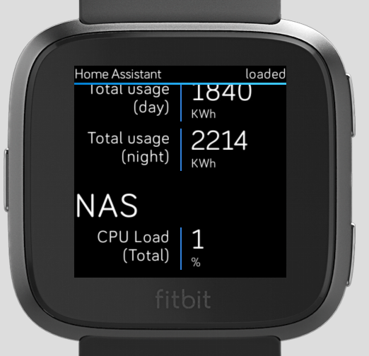

# FitBit-HomeAssistant
A Home Assistant app for Fitbit OS (Ionic &amp; Versa)

**Please not that this is a work in progress and needs a lot of work. Please feel welcome to contribute.**

# Current Status
Currently the app retrieves all groups from the HA instance set in the settings on the companion (phone) app (URL & Password). It will retrieve all devices/states in those groups and show them grouped like in the above screenshot. It relies on your friendly names and groups being set up properly. Sensors that are not in any group are not displayed. Hue light Groups are always displayed.

The app implement caching and will show cached (old) values instantly upon opening the app, the actual values should load in a few seconds after.

# Wishlist
The following is currently on my list to implement/improve. Feel free to pick any of these up:
* Show last updated in the header.
* Swipe screens sideways for special groups (e.g. switches and lights).
* Have action buttons in a popup for light/toggle items.
* Force refresh button.
* Resfresh periodically in the background.
* Hide missing units (undefined).
* Implement Icons (could be difficult due to limitations of Fitbit OS).
* Improve UI.

# Limitations
Due to the nature of the Fitbit APIs only secured (https) connections to Home Assitant work.
